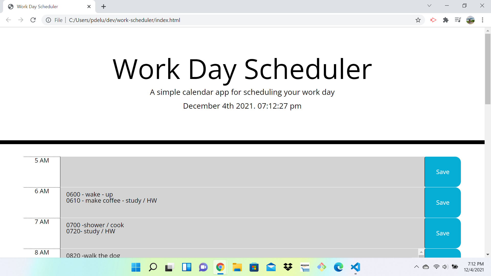

# work-scheduler

# what will my application need
  - current date and time
    - current hour
    - compare with calendar hours

 # what data will the application need to interact with?
 - create text area
 - ability to input text on time blocks
 - text saves to local storage , allows to show after page is refreshed
 - time blocks are color coded to show past, present, future

    

    LINK  repo : https://github.com/deluus/work-scheduler

    LINK  page : https://deluus.github.io/work-scheduler/
  

        